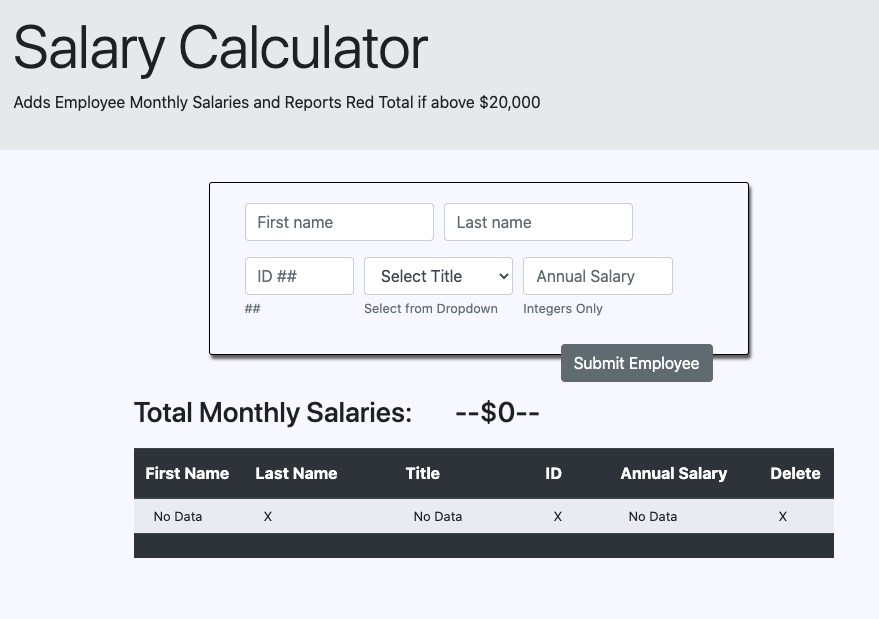
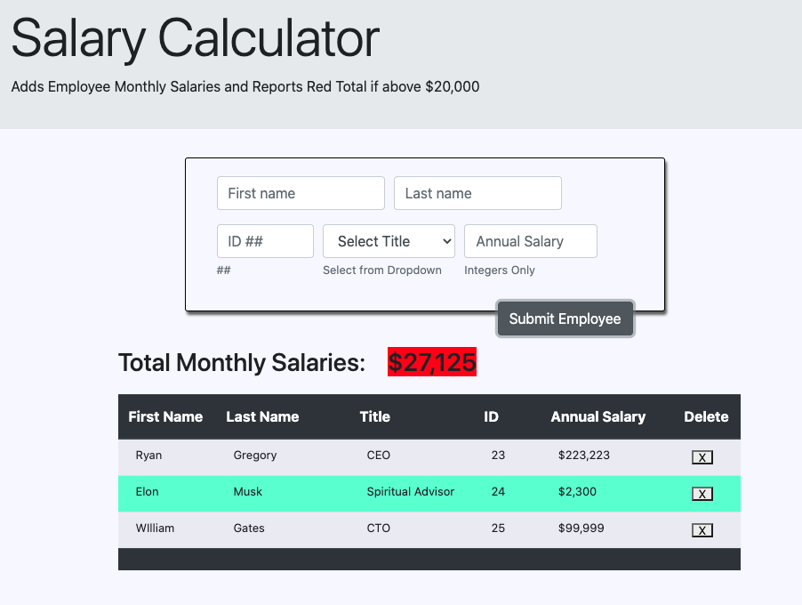

# Salary Calculator

## Description

_Duration: 8 Hour Sprint_

Salary Calculator records employee data and generates a monthly cost total.

Application takes in user input data of an employee.

Properties of employee include:

- First Name
- Last Name
- Employee ID#
- Title
- Annual Salary

The application stores the data and is displayed on the DOM. User is able to
delete each record individually by clicking a button.

If the total monthly costs of all employees is greater than \$20,000 the total is highlighted in red.

## Screen Shots

### Prerequisites

None

## Installation

1. Fork and Clone repo from GitHub and open in your favorite editor and browser.

## Usage

1. Input properties of employees in input fields.
2. ID and Annual Salary must be integers only.
3. Required value in input fields disabled do to ease of testing.
4. Click the "Submit Employee" button.
5. Employee Data will render below in table.
6. Hovering over an individual record will highlight that entry.
7. Click the corresponding Delete "X" Button to remove the employee record from record and from the DOM.

## Built With

- macOS Catalina
- Google Fiber Internet
- Visual Studio Code v1.46.1
- HTML5
- CSS 3

Languages

- JavaScript

Libraries

- JQuery v3.4.1
- Bootstrap v4.5.0

## Acknowledgement

Thanks to [Prime Digital Academy](www.primeacademy.io) who equipped and helped me to make this application a reality.

## Support

If you have suggestions or issues, please email me at [RyanGregoryCodes@gmail.com](www.google.com)
